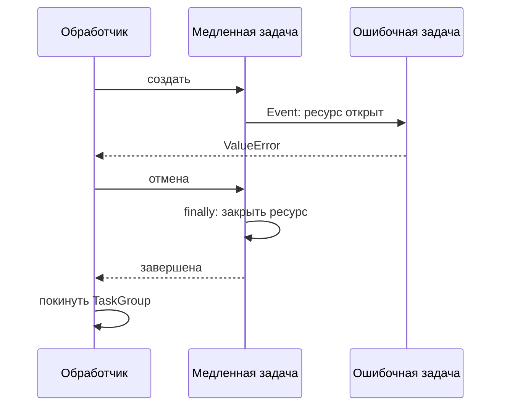

# Время жизни асинхронной операции

Редакция 2026-10-06. Материал к 14/2–3 после объяснения event loop в 14/1. Измерение производительности 14/4 остаётся отдельной частью. Исполняемый пример: Python 3.11+; проверяется локально, без внешнего API.

## Запрос закончился — что стало с его задачами

OrderFlow запрашивает несколько предложений доставки. Клиент отключился, одно предложение уже пришло, второй провайдер завис. Вопрос не только в скорости ответа: кто владеет оставшимися задачами, соединениями и результатами? Если обработчик создаёт задачи и теряет ссылки на них, работа продолжает жить вне понятной границы, а ошибки трудно связать с исходным запросом.

Сначала определяем политику. При предложениях цены можно принять частичный результат, если контракт допускает это. При составной операции, где нужны все результаты, отказ одной части должен завершить всю группу. В обоих случаях нужны конечный срок и освобождение ресурсов. Выбор политики предшествует выбору `gather` или `TaskGroup`.

`TaskGroup` задаёт область владения: при выходе из неё дочерние задачи уже завершены. Необработанная обычная ошибка одной задачи отменяет остальные; ошибки могут быть представлены группой исключений. Это удобный механизм для выбранной политики «нужны все», но его нельзя бездумно переносить на задачу, где частичные ответы допустимы. [Coroutines and Tasks, Python 3.12](https://docs.python.org/3.12/library/asyncio-task.html).

## Наблюдаемый пример отмены

```sh
python3 backend-devops-theory/assets/examples/mechanisms.py asyncio
```

Внутри одна задача открывает условный ресурс и сообщает через `Event`, что начала работу. Вторая ждёт именно этого сигнала и выбрасывает `ValueError`. Нет гонки «успела ли первая задача стартовать» и нет тайминга, от которого зависит правильность проверки. Первая задача освобождает ресурс в `finally`.

Ожидаемый журнал: `resource-open → resource-closed → scope-left`; `live_children=0`. Проверка обнаруживает ошибку дочерней задачи и отдельно подтверждает очистку при timeout. Она не утверждает, что настоящая HTTP-сессия или удалённая операция проверены: здесь демонстрируется жизненный цикл Python-задач.

Опыты с группой и timeout имеют отдельные задачи-владельцы; созданная задача обязательно ожидается через `await`. Это не фоновая работа без владельца. На проверенном Python 3.11.2 объединение двух опытов в одной задаче оставляло состояние отмены после TaskGroup и ломало следующий timeout. После разделения проверяется и отсутствие изменения `cancelling()` у вызывающей задачи. Совместимость подтверждена для конкретных запусков 3.11.2 и 3.12.3, а не выведена только из наличия API в Python 3.11.



## Отмена и deadline

Отмена — запрос на завершение в точке приостановки, а не выключатель удалённого сервера. Если провайдер уже принял запрос, локальный timeout не сообщает, выполнил ли он операцию. Для расчёта предложения можно вернуть частичный результат по контракту; для оформления доставки нужен устойчивый ключ операции и способ выяснить результат повтора.

Ресурс освобождается в `finally` или контекстном менеджере. Перехватить `CancelledError`, написать лог и продолжить бесконечный цикл — значит нарушить ожидание вызывающей стороны. После очистки отмену обычно распространяют дальше. [Правила cancellation](https://docs.python.org/3.12/library/asyncio-task.html#task-cancellation).

Предположим, весь запрос ограничен двумя секундами. Три попытки по две секунды каждая не укладываются в этот бюджет. Нужно учитывать общий deadline, ожидание свободного соединения и задержку перед retry. Повторять следует только согласованные временные отказы; неверный вход и недостаточные права не становятся исправными от повторения.

Ограничение конкурентности также относится к общей системе. Semaphore с лимитом 10 внутри каждого из 100 запросов допускает до 1000 одновременных обращений. Для лимита приложения нужен владелец на уровне приложения; при нескольких процессах их ограничения складываются. Пул соединений ограничивает ещё один ресурс и может создать собственную очередь. Значения выбираются по измерениям, а не по числу `async` в коде.

## Самостоятельная практика

В адаптере доставки текущего OrderFlow использовать три управляемых эмулятора: быстрый успешный, медленный и возвращающий некорректное тело. До реализации выбрать политику частичного результата. Сдать код, журнал значимых событий без credentials и проверки.

Критерии: (1) общий deadline действует на все попытки; (2) число одновременных обращений не превышает объявленный предел; (3) при отмене дочерние задачи завершаются и собственный клиент закрывается; (4) частичные ответы и полное отсутствие предложений различаются по контракту. Измерение wall time допускает небольшой заранее объяснённый запас среды; отсутствие живых задач проверяется отдельно, не выводится только из скорости.

Самопроверка: кто владелец клиента; какой ответ получит пользователь при одной ошибке; что произойдёт с удалённой операцией после timeout; почему semaphore внутри запроса не задаёт глобальный предел? Подсказки по порядку: нарисовать области владения, записать бюджет времени одной попытки, проверить отмену в точке ожидания. Следующий шаг — выполнить отказные сценарии своего адаптера.
