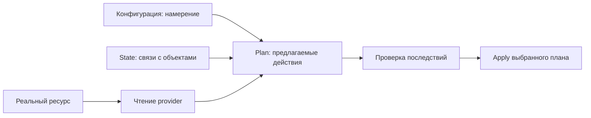

# Конфигурация, state, реальность и сохранённый plan

Редакция 2026-10-06. Материал к 24/2–3 после ресурсов/provider в 24/1 и GitLab CI в 12. Первый исполняемый опыт использует локальный `terraform_data`, без облачных ресурсов и внешнего provider. Он не закрывает remote lock, облачные права или стоимость инфраструктуры.

## Четыре разных объекта

В HCL написано, какой ресурс нужен. В облаке существует конкретный ресурс с идентификатором и фактическими атрибутами. State связывает адрес Terraform с этим объектом и хранит необходимые сведения об управлении им. Plan — результат расчёта изменений при определённых исходных условиях. Ни один из этих объектов нельзя без пояснения называть просто «текущее состояние».

Пример OrderFlow: в конфигурации VM указан один размер, в state записана связь `module.app.vm` с ID машины. Другой оператор изменил размер через API. HCL не изменился, но фактический ресурс уже другой. Именно такое внешнее расхождение мы называем drift. Если поменять HCL в редакторе, это новое желаемое состояние, а не доказательство внешнего drift. [Назначение state](https://developer.hashicorp.com/terraform/language/state/purpose).



Нормальный plan читает актуальные данные через provider. Опция `-refresh=false` меняет условия расчёта; отсутствие diff при устаревшем представлении не доказывает отсутствие внешнего изменения. Проверять это нужно на отдельном управляемом ресурсе, где изменение наблюдаемо через API. Подмена JSON state руками — другой опыт, он не воспроизводит тот же путь обнаружения.

## Как зелёная проверка пропускает изменение

CLI может успешно рассчитать непустой plan. Если скрипт воспринимает обычный exit 0 как «изменений нет», проверка ложноположительна. Для `plan -detailed-exitcode` различаются три исхода: 0 — пустой plan, 2 — изменения, 1 — ошибка. Скрипт должен сохранить именно код Terraform и обработать все три, а не вернуть код последнего `echo`. [Команда plan](https://developer.hashicorp.com/terraform/cli/commands/plan).

Подготовить лабораторию T24 в новом каталоге:

```sh
python3 backend-devops-theory/assets/labs/lab.py prepare /tmp/of-t24-student --case T24
python3 backend-devops-theory/assets/labs/lab.py check /tmp/of-t24-student
```

Для Terraform вне PATH передать `--terraform /полный/путь/terraform`. Runner не скачивает CLI/provider и не подключает remote backend. Ученик меняет `work/plan.sh`; фиксированный HCL принадлежит проверяющему fixture. Проверка создаёт собственное локальное состояние, последовательно проверяет пустой plan, изменение input и ошибочную конфигурацию. Сломанный wrapper смешивает первый и второй исход; корректный даёт 0/2/1. Итоговый exit самого `lab.py check` имеет другой смысл: 0 — все критерии выполнены, 1 — нарушение, 2 — среда не проверена.

## Lock и устаревший plan

Lock предотвращает одновременную запись state поддерживающими его операциями. Он не блокирует консоль облака и не превращает несколько облачных API-вызовов в общую транзакцию. Нельзя снимать lock только потому, что второй запуск не смог его получить: сначала установить, кто держит блокировку и завершилась ли его операция.

Сохранённый plan связывает review и apply: проверяющий рассматривает конкретные действия, а другой job применяет тот же артефакт. Если после plan изменился state, старый план может стать непригодным. Автоматически пересчитать его в apply-job — значит потерять связь с проверенным результатом. Нужен новый plan и просмотр его последствий; прошлое разрешение на одну VM не разрешает появившееся удаление БД.

Частичный apply тоже не равен rollback. Например, диск создался, а создание сети упёрлось в квоту. Перед повтором сопоставить state с инвентарём облака и рассчитать новый план. Стирание state для «чистого старта» может оставить оплачиваемый диск без управления.

## Самостоятельная практика

Сдать исправленный wrapper T24, три результата и объяснение двух наборов exit codes. Затем в текущей практике темы выполнить remote lock и stale plan по [операционному протоколу](../operations-labs.md). Это отдельные критерии; имя локального state `production` не означает настоящую production VM.

Критерии части: (1) wrapper различает пустой plan, diff и ошибку; (2) второй writer под lock не получает ложный успех; (3) устаревший saved plan не применяется как ранее проверенный; (4) область доказательства подписана: local/remote/cloud. Секреты backend передаются через поддерживаемое окружение, plan защищён как потенциально чувствительный артефакт.

Самопроверка: что state связывает с HCL; чем HCL change отличается от drift; почему lock не запрещает ручной API-вызов; что делать с уже созданным диском после отказа? Подсказки: нарисовать четыре объекта, сохранить исходный exit, сопоставить ID реального ресурса и запись state. Следующий шаг — предъявить отдельное доказательство каждого выбранного опыта.
